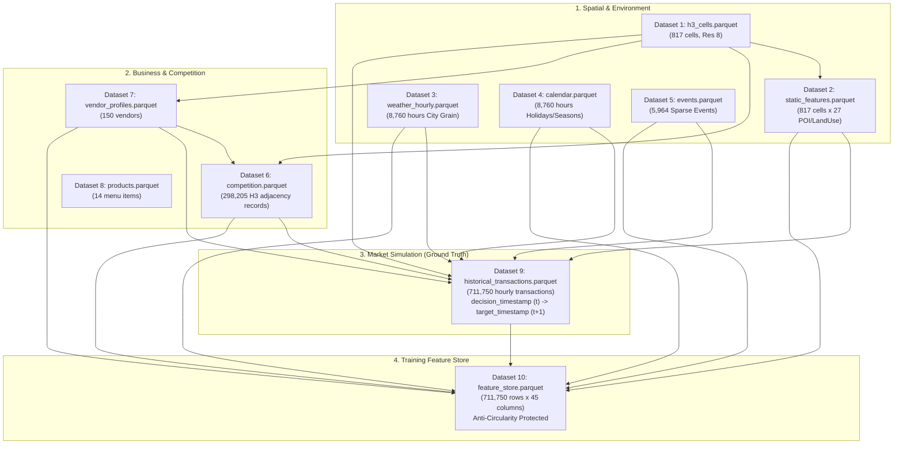

# GeoDemand AI — Dataset Catalog & Data Dictionary
### Pipeline Schema: `v2.1-next-hour-forecast`

This document is the authoritative data dictionary and architectural catalog for all datasets powering the **GeoDemand AI** demand forecasting and location optimization platform.

---

## 1. Pipeline Architecture Overview

GeoDemand AI implements a **10-dataset modular data pipeline**. Upstream contextual layers (geography, static POIs, meteorology, holidays, local events, competition, vendor configurations) are independently generated, source-tagged, and versioned. They are joined into a single unified training matrix (**Feature Store**) under a strict **Next-Hour Forecasting Contract** ($t \to t+1$).



---

## 2. Core Data Contracts & Anti-Circularity Guarantees

### 2.1 Next-Hour Prediction Horizon ($t \to t+1$)
* **Decision Time ($t$)**: The exact moment a vendor requests a routing decision (`decision_timestamp`). All dynamic features (weather conditions, calendar flags, local competitor density, event presence) are evaluated as-of time $t$.
* **Target Operating Window ($t+1$)**: The 1-hour service window $[t+1\text{h}, t+2\text{h})$ (`target_timestamp`).
* **Target Variable**: `expected_customer_count` measures customer footfall arriving during $[t+1\text{h}, t+2\text{h})$.
* **No Nowcasting**: Eliminates same-hour leakage ($t \to t$) so the ML problem genuinely matches real-world operational dispatch.

### 2.2 Anti-Circularity & Feature Isolation
* **Latent Factor Dropping**: Latent variables used by the market simulation engine to produce realistic variance (`hidden_skill_factor`, `popularity_score`, `quality_score`, `repeat_customer_rate`, `cell_reputation`) are **strictly excluded** by code assertion from `feature_store.parquet`.
* **Zero Identity Memorization**: `h3_cell_id`, `vendor_id`, `decision_timestamp`, and `target_timestamp` are retained in the feature store for grouping and auditing but are excluded from the `trainable_columns()` list. The model learns generalizable relationships across POIs, weather, and time rather than memorizing cell IDs.
* **Separation of Concerns**:
  * **ML Demand Model**: Predicts scalar expected footfall $\hat{Y}_{t+1}$ given candidate cell characteristics.
  * **Downstream Optimization Layer**: Ingests candidate cell predictions, applies vendor current location, travel time/fuel penalties, and inventory constraints to rank Top-5 locations.
  * **Product Mix Engine**: Multiplies predicted customer count by conditional item mix to derive unit sales, COGS, and profit.

---

## 3. Dataset Catalog & Detailed Schemas

### Dataset 1: H3 Spatial Grid (`h3_cells.parquet`)
* **Single Responsibility**: Canonical spatial indexing partitioning the target city into uniform hexagonal cells.
* **Provenance**: `real:spatial_indexing` (Uber H3 Indexing Engine, Resolution 8).
* **Granularity**: 1 row per H3 cell (817 cells covering ~8 km radius of Vijayawada).

| Column Name | Data Type | Description | Example / Range |
|---|---|---|---|
| `h3_cell_id` | string (index) | Unique 15-character hex H3 index | `8861892557fffff` |
| `latitude` | float64 | Geographic centroid latitude | `16.5062` |
| `longitude` | float64 | Geographic centroid longitude | `80.6480` |
| `resolution` | int64 | H3 resolution level | `8` (~0.737 km² area) |
| `city` | string | Urban administrative boundary | `Vijayawada` |
| `state` | string | State administrative boundary | `Andhra Pradesh` |
| `country` | string | Country code / name | `India` |
| `boundary_area_km2`| float64 | Geometric cell surface area | `0.737` km² |
| `source` | string | Data origin tag | `real:spatial_indexing` |

---

### Dataset 2: Static Spatial Features (`static_features.parquet`)
* **Single Responsibility**: Slowly changing POI counts, infrastructure density, and land-use balance per cell.
* **Provenance**: `real-proxy:osm_synthetic_fallback` (OpenStreetMap Overpass API ready with spatial smooth fallback).
* **Granularity**: 1 row per H3 cell (817 rows × 28 columns).

| Column Name | Data Type | Description | Range / Values |
|---|---|---|---|
| `h3_cell_id` | string | Foreign key to `h3_cells.parquet` | `8861892557fffff` |
| `population_density`| float64 | Estimated residential population | `500 - 45,000` / km² |
| `road_density` | float64 | Road length per unit area | `0.1 - 4.5` km/km² |
| `office_count` | int64 | Commercial office buildings & IT parks | `0 - 65` |
| `school_count` | int64 | Primary & secondary schools | `0 - 15` |
| `college_count` | int64 | Universities and degree colleges | `0 - 8` |
| `hospital_count` | int64 | Hospitals, clinics, healthcare centers | `0 - 12` |
| `restaurant_count` | int64 | Dine-in restaurants, cafes, eateries | `0 - 45` |
| `mall_count` | int64 | Shopping malls and commercial plazas | `0 - 6` |
| `park_count` | int64 | Public parks and recreational grounds | `0 - 10` |
| `bus_stop_count` | int64 | Public transit bus stops | `0 - 25` |
| `railway_station_count`| int64 | Railway stations in cell | `0 - 2` |
| `metro_station_count` | int64 | Metro / transit stations | `0 - 2` |
| `parking_count` | int64 | Designated public parking areas | `0 - 10` |
| `building_density` | float64 | Normalized built-up density index | `0.0 - 1.0` |
| `land_use_type` | string | Dominant land use classification | `residential`, `commercial`, `industrial` |
| `residential_ratio` | float64 | Fraction of zone devoted to housing | `0.0 - 1.0` |
| `commercial_ratio` | float64 | Fraction of zone devoted to commerce | `0.0 - 1.0` |
| `industrial_ratio` | float64 | Fraction of zone devoted to industry | `0.0 - 1.0` |
| `source` | string | Data origin tag | `real-proxy:osm_synthetic_fallback` |

---

### Dataset 3: Weather Hourly (`weather_hourly.parquet`)
* **Single Responsibility**: Hourly meteorological observations and short-term forecasts.
* **Provenance**: `real-proxy:open_meteo_synthetic_fallback` (Open-Meteo Historical Archive API ready with deterministic MD5-seeded fallback).
* **Granularity**: 1 row per hour at City Grain (8,760 hours). Broadcast-joined to H3 cells to avoid 7.2M redundant rows.

| Column Name | Data Type | Description | Units / Values |
|---|---|---|---|
| `timestamp` | datetime64[ns] | Hour start timestamp | `2025-01-01 00:00:00` |
| `temperature` | float64 | Ambient air temperature | `16.0 - 44.0` °C |
| `humidity` | float64 | Relative humidity | `20.0 - 98.0` % |
| `rainfall` | float64 | Hourly precipitation depth | `0.0 - 30.0` mm |
| `wind_speed` | float64 | Surface wind velocity | `0.0 - 35.0` km/h |
| `pressure` | float64 | Atmospheric barometric pressure | `995.0 - 1020.0` hPa |
| `cloud_cover` | float64 | Cloud cover percentage | `0.0 - 100.0` % |
| `visibility` | float64 | Horizontal visibility distance | `1.0 - 12.0` km |
| `weather_condition`| string | Categorical weather state | `clear`, `cloudy`, `rain` |
| `uv_index` | float64 | Solar ultraviolet index | `0.0 - 11.0` |
| `source` | string | Data origin tag | `real-proxy:open_meteo_synthetic_fallback` |

---

### Dataset 4: Calendar & Holidays (`calendar.parquet`)
* **Single Responsibility**: Temporal indicators, civic/festival holidays, and academic calendars.
* **Provenance**: `real:holidays_lib` (Python `holidays` library for India / Andhra Pradesh).
* **Granularity**: 1 row per hour (8,760 hours).

| Column Name | Data Type | Description | Values |
|---|---|---|---|
| `timestamp` | datetime64[ns] | Hour timestamp | `2025-01-01 10:00:00` |
| `hour` | int64 | Hour of day | `0 - 23` |
| `weekday` | string | Day name of the week | `Monday` - `Sunday` |
| `month` | int64 | Month of the year | `1 - 12` |
| `season` | string | Indian seasonal phase | `winter`, `summer`, `monsoon`, `post_monsoon` |
| `quarter` | int64 | Calendar quarter | `1 - 4` |
| `is_weekend` | bool | Saturday or Sunday flag | `True` / `False` |
| `is_holiday` | bool | Civic / gazetted / festival holiday | `True` / `False` |
| `holiday_name` | string | Canonical holiday title | e.g. `Sankranti`, `Diwali`, `Independence Day` |
| `festival_name` | string | Regional festival title | e.g. `Ugadi`, `Dussehra` |
| `school_vacation`| bool | Academic vacation window flag | `True` / `False` |
| `source` | string | Data origin tag | `real:holidays_lib` |

---

### Dataset 5: Local Events (`events.parquet`)
* **Single Responsibility**: Hyperlocal stochastic demand events (college fests, weddings, religious gatherings, marathons).
* **Provenance**: `simulated:sparse_stochastic` (Sparse distribution, 2% cell-day density).
* **Granularity**: 1 row per event occurrence (5,964 records).

| Column Name | Data Type | Description | Values |
|---|---|---|---|
| `event_id` | string | Unique event identifier | `a1b2c3d4` |
| `h3_cell_id` | string | H3 cell hosting the event | Foreign key to `h3_cells` |
| `timestamp` | datetime64[ns] | Event start timestamp | `2025-03-15 10:00:00` |
| `event_type` | string | Event classification | `college_fest`, `wedding`, `religious_gathering`, `marathon`, `local_market`, `concert` |
| `expected_attendance`| int64 | Estimated gathering footfall | `50 - 3,500` |
| `event_importance` | float64 | Multiplier weight for demand lift | `0.3 - 0.8` |
| `duration_hours` | int64 | Event operational span | `2 - 8` hours |
| `source` | string | Data origin tag | `simulated:sparse` |

---

### Dataset 6: Competition Density (`competition.parquet`)
* **Single Responsibility**: Hyperlocal vendor competition per category using real H3 spatial adjacency.
* **Provenance**: `hybrid:h3_spatial_adjacency` (Real H3 `grid_disk` k-ring neighborhood over simulated vendor home cells).
* **Granularity**: 817 cells × 365 days = 298,205 rows.

| Column Name | Data Type | Description | Values |
|---|---|---|---|
| `date` | datetime64[ns] | Observation calendar date | `2025-01-01` |
| `h3_cell_id` | string | Target H3 cell | `8861892557fffff` |
| `tea_vendor_count` | int64 | Competitor tea/snack stalls in k-ring | `0 - 8` |
| `snack_vendor_count`| int64 | Competitor fast-food/snack stalls | `0 - 8` |
| `fruit_vendor_count`| int64 | Competitor fruit/juice carts | `0 - 6` |
| `food_truck_count` | int64 | Total hot meal food trucks in k-ring | `0 - 10` |
| `repair_van_count` | int64 | Mobile vehicle/device repair vans | `0 - 4` |
| `salon_van_count` | int64 | Mobile grooming & salon vans | `0 - 4` |
| `competition_score` | float64 | Normalized saturation index $\min(1.0, \frac{N}{8})$ | `0.0 - 1.0` |
| `source` | string | Data origin tag | `hybrid:h3_spatial_adjacency` |

---

### Dataset 7: Vendor Profiles (`vendor_profiles.parquet`)
* **Single Responsibility**: Vendor business attributes, service velocity, capacity, and cost parameters.
* **Provenance**: `simulated:business_profiles` (150 vendor profiles).

| Column Name | Data Type | Trainable Feature? | Description |
|---|---|---|---|
| `vendor_id` | string | ❌ Excluded (ID) | Unique vendor ID (`V_001` - `V_150`) |
| `vendor_category` | string | ✅ Trainable | `food`, `fruits`, `salon`, `repair` |
| `vendor_name` | string | ❌ Excluded (String) | Synthetic business brand |
| `menu_type` | string | ❌ Excluded (Text) | Top menu items preview |
| `average_order_value`| float64 | ✅ Trainable | Typical cart spend per customer (₹40 - ₹250) |
| `preparation_time` | float64 | ✅ Trainable | Average order prep time in minutes (1.5 - 15.0) |
| `service_time` | float64 | ❌ Excluded | Full customer transaction turnaround (mins) |
| `inventory_capacity`| int64 | ✅ Trainable | Max customer units serviceable per shift |
| `operating_start` | int64 | ❌ Excluded | Daily shift start hour (8:00 AM) |
| `operating_end` | int64 | ❌ Excluded | Daily shift close hour (9:00 PM) |
| `fixed_cost_per_day`| float64 | ❌ Excluded | Base daily fuel, stall, and vehicle overhead (₹300 - ₹900) |
| `variable_cost_rate`| float64 | ❌ Excluded | COGS percentage of revenue (0.28 - 0.55) |
| `home_cell_id` | string | ❌ Excluded (ID) | Vendor default base cell |
| `hidden_skill_factor`| float64 | 🚫 LEAKAGE (Dropped) | Latent service quality multiplier |
| `popularity_score` | float64 | 🚫 LEAKAGE (Dropped) | Latent brand loyalty score |
| `quality_score` | float64 | 🚫 LEAKAGE (Dropped) | Latent food/service rating |
| `repeat_customer_rate`| float64| 🚫 LEAKAGE (Dropped) | Latent return rate |
| `source` | string | ❌ Excluded | `simulated:business_profiles` |

---

### Dataset 8: Product Catalogue (`products.parquet`)
* **Single Responsibility**: Canonical menu item definitions, shelf-life, and environmental affinities for downstream revenue/COGS simulation.
* **Provenance**: `simulated:product_catalog` (14 canonical menu items).

| Product ID | Vendor Category | Product Name | Selling Price (₹) | Cost Price (₹) | Prep Time | Shelf Life | Rain Affinity | Cold Affinity | Lunch Affinity |
|---|---|---|---|---|---|---|---|---|---|
| `p_tea` | `food` | Irani Chai & Samosa | 40 | 16.80 | 3 min | 6 hrs | 1.45 | 1.30 | 0.80 |
| `p_meals` | `food` | Andhra Veg Thali | 120 | 50.40 | 4 min | 6 hrs | 0.80 | 0.90 | 1.85 |
| `p_dosa` | `food` | Ghee Karam Dosa | 70 | 29.40 | 3 min | 6 hrs | 1.20 | 1.10 | 1.10 |
| `p_fruit` | `fruits` | Cut Fruit Salad Bowl | 60 | 25.20 | 2 min | 24 hrs | 0.50 | 0.60 | 1.40 |
| `p_juice` | `fruits` | Sugarcane / Mosambi Juice | 40 | 16.80 | 2 min | 24 hrs | 0.40 | 0.50 | 1.50 |
| `p_hair` | `salon` | Express Haircut & Styling | 150 | 30.00 | 15 min | None | 0.85 | 0.95 | 0.90 |
| `p_shave` | `salon` | Beard Grooming & Shave | 80 | 16.00 | 12 min | None | 0.90 | 0.95 | 0.90 |
| `p_screen`| `repair`| Mobile Screen Replacement | 450 | 135.00 | 25 min | None | 0.90 | 1.00 | 1.00 |
| `p_puncture`| `repair`| Tubeless Tyre Puncture Repair | 100 | 30.00 | 10 min | None | 1.30 | 1.00 | 0.80 |

---

### Dataset 9: Historical Transactions (`historical_transactions.parquet`)
* **Single Responsibility**: Generates business ground truth under the Next-Hour Demand Contract ($t \to t+1$).
* **Provenance**: `simulated:market_outcomes` (150 vendors × 365 days × 13 hours = 711,750 observations).

| Column Name | Data Type | Description |
|---|---|---|
| `transaction_id` | string | Unique transaction identifier |
| `decision_timestamp` | datetime64[ns] | Time $t$ when context is evaluated |
| `target_timestamp` | datetime64[ns] | Time $t+1\text{h}$ when the 1-hour operating window starts |
| `vendor_id` | string | Vendor identifier |
| `h3_cell_id` | string | Location cell where demand occurred |
| `expected_customer_count` | int64 | Target footfall during $[t+1\text{h}, t+2\text{h})$ |
| `average_order_value` | float64 | Per-customer spend (₹) |
| `revenue` | float64 | Gross revenue = `expected_customer_count` × `AOV` |
| `ingredient_cost` | float64 | Variable COGS = `revenue` × `variable_cost_rate` |
| `fuel_cost` | float64 | Hourly amortized fixed overhead |
| `operating_cost` | float64 | Total cost = `ingredient_cost` + `fuel_cost` |
| `profit` | float64 | Net profit = `revenue` - `operating_cost` |
| `top_selling_product` | string | Top-ordered menu item during window |
| `weather_multiplier` | float64 | Auditable weather lift component |
| `holiday_multiplier` | float64 | Auditable holiday lift component |
| `competition_multiplier` | float64 | Auditable competitor suppression component |
| `event_multiplier` | float64 | Auditable local event boost component |
| `noise_component` | float64 | Heteroscedastic noise term $\sim \mathcal{N}(0, \sigma \sqrt{\mu})$ |
| `source` | string | Data origin tag |

---

### Dataset 10: Unified Feature Store (`feature_store.parquet`)
* **Single Responsibility**: The definitive, ML-ready matrix used to train and validate all demand models.
* **Provenance**: `hybrid:joined_feature_store` (711,750 rows × 45 columns, 0 nulls, 0 leakage columns).

```text
Identity & Timestamps (Grouping/Audit Only — Excluded from Trainable Features)
├── decision_timestamp
├── target_timestamp
├── h3_cell_id
└── vendor_id

Static Spatial Features (Trainable)
├── population_density
├── road_density
├── office_count
├── school_count
├── college_count
├── hospital_count
├── restaurant_count
├── mall_count
├── park_count
├── bus_stop_count
├── railway_station_count
├── metro_station_count
├── parking_count
├── building_density
├── residential_ratio
├── commercial_ratio
└── industrial_ratio

Meteorological Context @ Decision Time (Trainable)
├── temperature
├── humidity
├── rainfall
├── wind_speed
├── pressure
├── cloud_cover
├── visibility
├── weather_condition
└── uv_index

Calendar & Season Context @ Decision Time (Trainable)
├── hour
├── weekday
├── month
├── season
├── quarter
├── is_weekend
├── is_holiday
└── school_vacation

Dynamic Competitive & Event Signals (Trainable)
├── competition_score
└── event_importance

Vendor Business Characteristics (Trainable)
├── vendor_category
├── inventory_capacity
├── preparation_time
└── average_order_value

Target Variable (Supervised ML Regression Target)
└── expected_customer_count
```

---

## 4. Legacy Dataset Designation

| Artifact Path | Status | Policy |
|---|---|---|
| `data/simulated/dataset_v2bc7185bc94d.parquet` | **LEGACY v1 MONOLITHIC DATASET** | **DO NOT USE FOR MODEL TRAINING.** Retained strictly as historical proof of architectural evolution from monolithic table to modular pipeline. |
| `data/processed/feature_store.parquet` | **CANONICAL TRAINING DATASET** | **ACTIVE ML TRAINING SOURCE** for all GeoDemand AI models. |

---

## 5. Pipeline Verification & Manifest

The current dataset build is cryptographically snapshot in `data/processed/pipeline_manifest_v*.json`:

* **Pipeline Schema**: `v2.1-next-hour-forecast`
* **Automated Unit Tests**: `pytest tests/test_data_pipeline.py` $\to$ **100% Passed**
* **Domain Validation Suite**:
  * Rainy evenings near hospitals $\to$ food demand up: **✅ PASS (+43.82% lift)**
  * Lunch near offices $\to$ meal demand up: **✅ PASS (+79.67% lift)**
  * Holidays $\to$ overall demand up: **✅ PASS (+27.16% lift)**
  * Weekends $\to$ salon demand up: **✅ PASS (+24.28% lift)**
  * More competitors $\to$ lower per-vendor demand: **✅ PASS (-18.38% suppression)**
